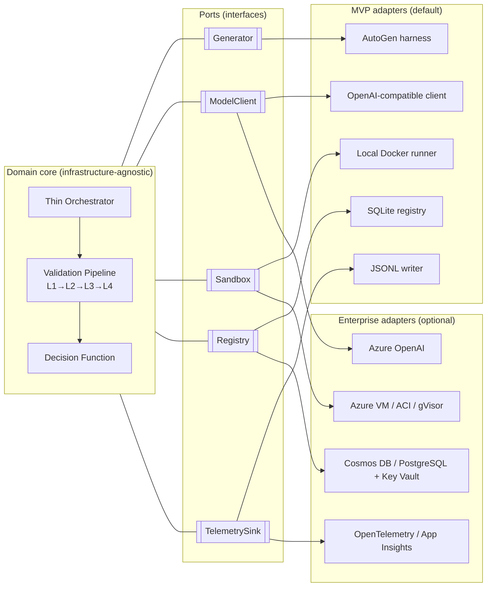
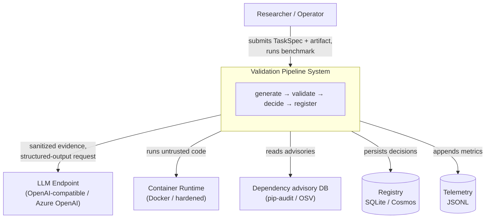
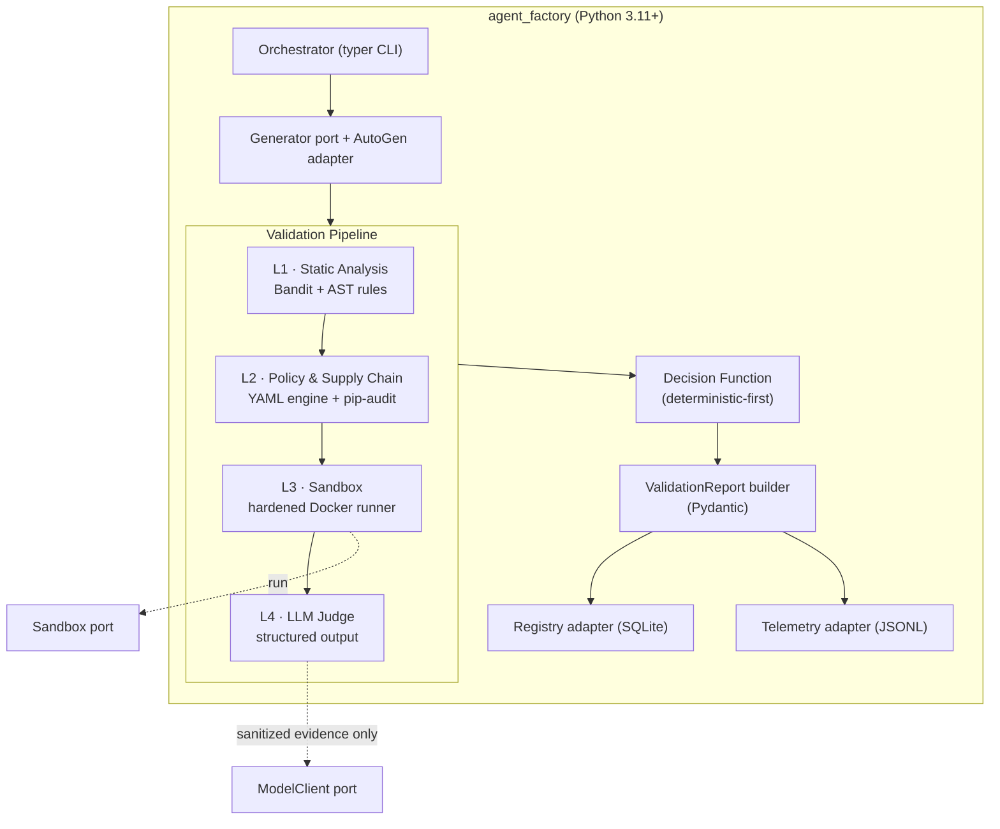
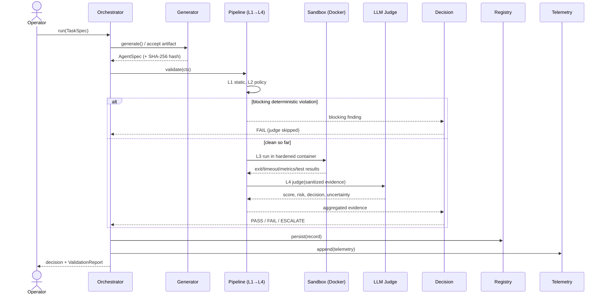
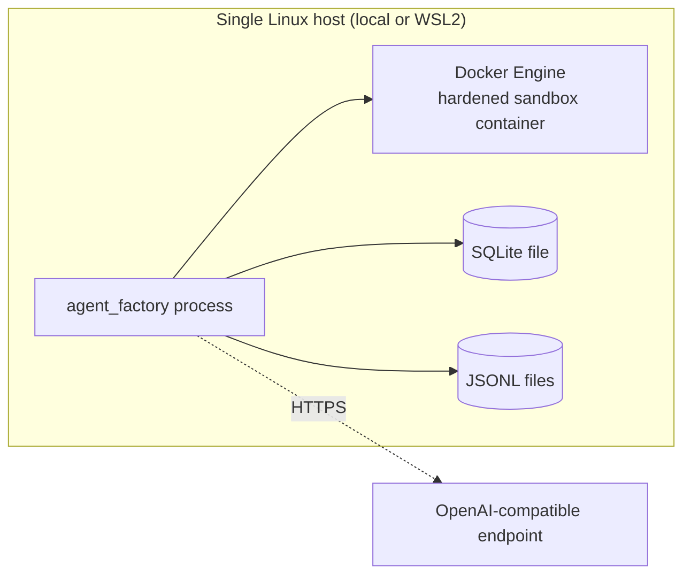
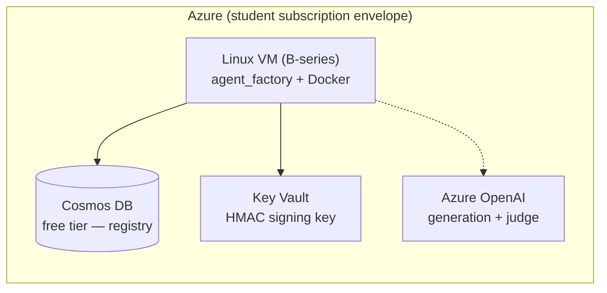

# Solution Architecture — Automated Validation Pipeline for LLM-Generated Micro-Agents

**Document type:** Solution Architecture Specification
**Status:** Draft for technical review
**Audience:** Technical lead / scientific advisor / industry expert
**Author:** Bobur Yusupov
**Version:** 0.1 (draft)

---

## Document Control

| | |
|---|---|
| Project | Design and Evaluation of an Automated Validation Pipeline for LLM-Generated Micro-Agents in Enterprise Multi-Agent Systems |
| Phase | MVP (12-week implementation), pre-implementation architecture sign-off |
| Related docs | `README.md` (project overview), `ARCHITECTURE_ENTERPRISE.md` (cloud target state), Task 2 Technical Description (revised MVP) |
| Decision style | Architecture Decision Records (ADR) — see §10 |
| Reviewers | Viktor Kauk (advisor), Izzet Mustafayev (industry expert), Technical lead |

> **Reviewer's note.** This document is written to be challenged. Each significant choice is captured as an ADR with explicit alternatives and consequences (§10). The single most important architectural decision is **§4 / ADR-001 (Ports & Adapters)**, which is what lets the MVP stay lightweight while presenting a credible enterprise deployment story.

---

## 1. Purpose & Context

Dynamically generated micro-agents cannot be trusted to execute in an enterprise environment without inspection: generated code may carry unsafe behavior, dependency risk, incorrect logic, or prompt-injection-sensitive output. This system is the **validation gate** that sits between *agent generation* and *agent registration/execution*.

The system accepts a task specification and a generated Python micro-agent, runs it through a deterministic-first layered validation pipeline, and emits an auditable decision: **PASS / FAIL / ESCALATE**.

**This is a research MVP**, not a production platform. The architecture is therefore optimized for *measurability, reproducibility, and a low integration surface*, while keeping a clean path to enterprise-grade deployment.

### 1.0 Full system loop vs measured boundary

The validator sits inside a larger **Agent Factory loop**: `ticket → route (reuse existing agent?) → else generate → validate → register → execute`. This loop is **built and demonstrated** end-to-end (`Router`, `Executor`, agent repertoire in the registry, `handle_ticket` orchestration), so the system can be shown working as a whole. However, the **rigorously measured scientific contribution is the validation gate alone** (§9 benchmark). Routing and execution are deliberately thin (exact `capability` match; local execution of an already-validated agent) and are explicitly out of the evaluation. The safety boundary is enforced in the loop: an agent reaches execution **only** after a PASS verdict.

### 1.1 Architecturally significant requirements

| # | Requirement | Type |
|---|---|---|
| R1 | Deterministic checks must take precedence over LLM judgment; the judge must not be able to approve a hard security failure | Functional / Security |
| R2 | Every run must produce a complete, machine-readable, hash-anchored `ValidationReport` | Functional / Auditability |
| R3 | The same corpus must be runnable under 3 layer configurations (static-only / +policy / full) with comparable results | Evaluation |
| R4 | Untrusted generated code must execute under strong isolation (no network, bounded CPU/mem/time) | Security |
| R5 | The model used as judge must be swappable without changing pipeline logic | Maintainability |
| R6 | The registry backend must be swappable (local SQLite ↔ enterprise cloud) without changing pipeline logic | Maintainability / Enterprise narrative |
| R7 | Runs must be reproducible: pinned models, pinned dependencies, pinned container image digests | Reproducibility |

## 2. Architectural Goals & Principles

1. **One mechanism, evaluated well.** The thesis contribution is the *validation pipeline*. Everything else (orchestrator, registry, cloud) exists only to demonstrate and measure it.
2. **Deterministic-first, LLM-second.** Hard evidence is authoritative; the LLM judge is advisory on top, never an override of a security verdict.
3. **Ports & Adapters (Hexagonal).** The pipeline core depends on *interfaces*, never on concrete infrastructure. Local and cloud are interchangeable adapters. → *This is the backbone of the enterprise story.*
4. **Reproducibility as a first-class concern.** Pin everything; record provenance in every telemetry record.
5. **Minimal integration surface in the MVP.** Managed cloud services are adapters behind ports, not load-bearing dependencies.
6. **Configurations over branches.** The three evaluation conditions are *compositions of layers*, not `if` statements — this keeps benchmark results scientifically comparable.

## 3. Quality Attributes (Non-Functional Requirements)

| Attribute | Target / Tactic |
|---|---|
| **Security (isolation)** | Untrusted code runs only inside a hardened container: `--network=none`, `--cap-drop=ALL`, `--read-only` + tmpfs, non-root, `no-new-privileges`, pids/cpu/mem limits, host-enforced timeout |
| **Auditability** | SHA-256 artifact hash + complete `ValidationReport` per run; registry row links hash → decision → report path |
| **Reproducibility** | Pinned model+version, pinned deps with hashes, container image pinned by digest, `temperature=0` |
| **Performance** | Per-layer + end-to-end latency captured (median/p95/p99); predeclared p95 ceiling gates the pilot |
| **Determinism of decision** | Decision is a pure function of layer evidence; deterministic findings strictly dominate the judge |
| **Maintainability** | Ports & Adapters; each layer behind a uniform `Layer` contract; unit-testable in isolation |
| **Portability** | Runs on a single Linux host (local/WSL2) or one Azure Linux VM; no managed-service hard dependency |
| **Cost control** | Judge invoked only in the full-pipeline condition; token usage recorded per run |

## 4. Architectural Style — Ports & Adapters

The core (schemas + pipeline + decision logic) is **infrastructure-agnostic**. It talks to the outside world only through **ports** (interfaces). Each port has a lightweight MVP adapter and an optional enterprise adapter.



**Why this matters for the defense:** the MVP ships with the left column (lightweight, $0, no cloud risk). The enterprise narrative is demonstrated by the right column — *real adapters* that plug into the same ports without touching the pipeline. The thesis claim "this validator embeds into an enterprise Agent Factory" becomes a demonstrable fact, not a hand-wave.

## 5. System Context (C4 — Level 1)



## 6. Container / Component View (C4 — Level 2)



### 6.1 The `Layer` contract

All four layers implement one interface, so the pipeline is a composable list and the benchmark conditions are subsets of that list:

```python
class LayerResult(BaseModel):
    layer: str
    status: Literal["pass", "fail", "escalate", "skip"]
    blocking: bool                 # a blocking failure forces FAIL regardless of later layers
    findings: list[Finding]
    timing_ms: float

class Layer(Protocol):
    name: str
    def run(self, ctx: ValidationContext) -> LayerResult: ...

# Benchmark conditions are declarative compositions — no branching:
CONDITIONS = {
    "static_only":   [L1],
    "static_policy": [L1, L2],
    "full":          [L1, L2, L3, L4],
}
```

## 7. Data Architecture

### 7.1 Canonical schemas (Pydantic v2)

| Schema | Minimum fields |
|---|---|
| **TaskSpec** | `task_id, task_description, input_schema, output_schema, allowed_imports, allowed_dependencies, prohibited_behaviors, risk_tier, acceptance_tests` |
| **AgentSpec** | `agent_id, generated_code_path, manifest, requirements, declared_tools, resource_limits, expected_entrypoint, model_metadata` |
| **ValidationReport** | `artifact_hash, per_layer_status, findings, timings, sandbox_result, judge_result, final_decision, reasons, report_version` |

### 7.2 Registry record (port-neutral)

The `Registry` port stores an identical logical record regardless of backend:

```
artifact_hash (SHA-256, PK) · task_id · final_decision · validation_timestamp
· report_path · model_metadata · condition · hmac_signature?
```

- **MVP adapter:** single SQLite table.
- **Enterprise adapter:** Cosmos DB document (or PostgreSQL row) + HMAC key sourced from Key Vault. Same logical schema → drop-in.

### 7.3 Telemetry record (JSONL, one line per run)

Each record carries enough provenance for full reconstruction:

```
run_id · artifact_hash · condition · per_layer_status · per_layer_timing_ms
· total_latency_ms · sandbox_metrics · judge_result · token_usage · cost_estimate
· model_metadata · policy_hash · image_digest · final_decision · timestamp
```

Analysis: **DuckDB** queries the JSONL/Parquet directly (no server); pandas/R for final plots.

## 8. Runtime View — Primary Workflow



### 8.1 Decision logic (deterministic-first)

| Condition | Decision |
|---|---|
| Hard static violation or forbidden policy violation | **FAIL** |
| Sandbox timeout / resource violation / blocked network / failed mandatory acceptance test | **FAIL or ESCALATE** (by severity) |
| No deterministic violation, tests pass, judge ambiguous | **ESCALATE** |
| No deterministic violation, tests pass, judge high-confidence correct | **PASS** |
| Deterministic layers vs judge conflict | **ESCALATE** (deterministic evidence shown first) |

> **Invariant (R1):** the judge can move a case toward ESCALATE or confirm PASS, but can **never** overturn a blocking deterministic FAIL.

## 9. Deployment Views

### 9.1 MVP deployment (default — local / single host)



Zero managed services. Reproducible on one machine. This is what the benchmark runs on.

### 9.2 Enterprise deployment (optional — Azure-light, narrative)



Same code, different adapters selected by configuration. Demonstrates enterprise embedding within free-tier / student-credit limits (see §11).

## 10. Architecture Decision Records

> ADRs capture *why*, with alternatives and consequences, so reviewers can challenge the reasoning, not just the outcome.

### ADR-001 — Ports & Adapters (Hexagonal) core
- **Decision:** the pipeline core depends only on `Generator / ModelClient / Sandbox / Registry / TelemetrySink` interfaces.
- **Alternatives:** (a) direct coupling to SQLite/Docker/OpenAI; (b) full microservices.
- **Consequences:** + MVP stays lightweight; + enterprise adapters are drop-in (defense story); + each layer/adapter is independently testable. − a small upfront abstraction cost.
- **Status:** Accepted.

### ADR-002 — SQLite as default registry, cloud as adapter
- **Decision:** default `Registry` = SQLite; Cosmos DB / PostgreSQL + Key Vault are optional adapters.
- **Rationale:** the pipeline writes one row per run; SQLite is strictly faster and simpler locally. Managed DBs add latency, auth, billing, and integration risk with **no MVP benefit**. The enterprise need is met by an *adapter*, not by making the MVP depend on the cloud.
- **Consequences:** + $0, zero-ops MVP; + enterprise-grade registry demonstrable on demand. − concurrent multi-writer scenarios are out of scope for MVP (acceptable: single-host benchmark).
- **Status:** Accepted.

### ADR-003 — Single hardened Docker sandbox (no multi-runtime in MVP)
- **Decision:** one hardened Docker execution path; gVisor/ACI are optional post-MVP.
- **Rationale:** meaningful isolation without multi-runtime integration risk; keeps latency numbers comparable.
- **Consequences:** + tractable in 12 weeks. − container-escape-class threats not fully covered (documented as a known limitation; gVisor is the stated extension).
- **Status:** Accepted.

### ADR-004 — Deterministic-first decision; judge is advisory
- **Decision:** deterministic layers are authoritative; the LLM judge cannot override a blocking FAIL.
- **Rationale:** trustworthiness of the gate; protects against the judge itself being manipulated (prompt injection).
- **Consequences:** + defensible safety property (R1); + graceful degradation (if judge agreement <70%, demote to explanatory only — a predeclared fallback). − judge cannot *rescue* a borderline-but-safe case; such cases ESCALATE rather than PASS (acceptable, conservative).
- **Status:** Accepted.

### ADR-005 — Judge sees sanitized, structured evidence only
- **Decision:** the judge never receives raw agent output/code; it receives structured findings, test results, and bounded snippets.
- **Rationale:** limits prompt-injection of the validator; makes judge inputs reproducible. This is itself a measurable research point.
- **Consequences:** + injection-resistance; + reproducible judge inputs. − evidence-sanitization layer must be carefully designed.
- **Status:** Accepted.

### ADR-006 — Benchmark conditions as layer compositions, not branches
- **Decision:** static-only / +policy / full are subsets of the layer list.
- **Rationale:** scientific comparability; no code-path divergence between conditions.
- **Consequences:** + clean, comparable results; + trivially extensible. − requires the uniform `Layer` contract (already adopted).
- **Status:** Accepted.

### ADR-007 — Pin everything for reproducibility
- **Decision:** pin model name+version, dependencies with hashes (via `uv`), container image by digest; `temperature=0`.
- **Rationale:** R7; defensible "any run is reconstructable" claim.
- **Consequences:** + reproducibility. − periodic maintenance of pins (acceptable within a 12-week window).
- **Status:** Accepted.

## 11. Technology Stack (with rationale)

| Concern | Choice | Rationale / Status |
|---|---|---|
| Language & schemas | Python 3.11+, **Pydantic v2** | Strict typed contracts; structured-output friendly · Mandatory |
| Dependency mgmt | **uv** + hashed lockfile | Fast, reproducible; hashes feed L2 supply-chain checks · Recommended swap (from pip/venv) |
| Lint/format | **ruff** | Single fast tool (replaces black/flake8/isort) · Recommended |
| CLI | **typer** | Clean `run` / `benchmark` commands · Recommended |
| Agent harness | **AutoGen AgentChat (pinned)** | Provides the "multi-agent" framing; isolated behind `Generator` port · Mandatory |
| Model client | OpenAI-compatible + **instructor / native structured outputs** | Guarantees schema-valid judge output · Mandatory |
| Static analysis | **Bandit + custom AST rules** | Detects `eval/exec`, dynamic import, subprocess, sockets, fs writes, ctypes · Mandatory |
| Supply chain | **pip-audit** + pinned/hashed reqs | Vulnerable-dependency + integrity checks · Mandatory |
| Policy engine | **YAML + deterministic Python checker** | Simple, auditable allow/denylists (OPA/Rego = overkill) · Mandatory |
| Sandbox | **Docker Engine** (hardened) | Isolation without multi-runtime risk · Mandatory |
| Registry (default) | **SQLite + SHA-256** | Zero-ops local registry · Mandatory |
| Registry (enterprise) | **Cosmos DB (free tier) / PostgreSQL + Key Vault** | Enterprise-narrative adapter · Optional |
| Telemetry | **JSONL** + **DuckDB** + pandas/R | Append-only logs; SQL-over-files analysis · Mandatory (DuckDB recommended) |
| Sandbox access | **docker SDK for Python** | Programmatic, not shell strings · Recommended |
| CI | **pytest, pre-commit, GitHub Actions** | Unit/smoke/format/security gates · Mandatory |
| Threat mapping | **MITRE ATLAS** | Categorize adversarial corpus patterns · Recommended |
| Cloud model | **Azure OpenAI** | Generation + judge via student credit · Optional |
| Advanced isolation | **gVisor / runsc**, ACI, Container Apps | Post-MVP isolation/exec tiers · Optional |

## 12. Cross-Cutting Concerns

- **Security:** untrusted code is *only* ever executed in the hardened container (§3); the host process never `exec`s generated code. Static + policy layers run on source without execution.
- **Reproducibility:** provenance (`model_metadata`, `policy_hash`, `image_digest`) in every telemetry record; pinned everything (ADR-007).
- **Observability:** structured per-layer timings and outcomes; JSONL → DuckDB queries; OpenTelemetry deferred behind `TelemetrySink` port.
- **Cost:** judge runs only in the `full` condition; token usage + cost estimate recorded per run.
- **Testability:** ports allow fakes/stubs; the walking skeleton runs end-to-end with stub layers before any layer is deepened.

## 13. Risk Register

| # | Risk | Likelihood | Impact | Mitigation / Fallback |
|---|---|---|---|---|
| K1 | Corpus construction underestimated (144 artifacts + ground-truth labels) | High | High | Start corpus + label taxonomy in Weeks 1–2; map risky cases to MITRE ATLAS; reuse generation harness to produce candidates |
| K2 | Judge–human agreement < 70% | Medium | Medium | ADR-004 fallback: demote judge to explanatory; deterministic layers remain authoritative |
| K3 | Docker sandbox flakiness > 20% | Medium | Medium | Run sequentially on one fixed host; reduce parallelism/corpus; pin image digest |
| K4 | p95 latency exceeds predeclared ceiling | Medium | Medium | Reduce repeats; optimize sandbox/test execution before adding features |
| K5 | Azure OpenAI access unavailable on student subscription | Medium | Low | Use OpenAI-compatible endpoint directly; cloud is optional, behind `ModelClient` port |
| K6 | Schema churn after implementation start | Medium | High | Freeze TaskSpec/AgentSpec/ValidationReport by end of Week 2 (fallback trigger) |
| K7 | Container-escape-class threats beyond Docker isolation | Low | High | Documented limitation; gVisor stated as the optional hardening tier |

## 14. Scope Boundaries

**In scope (MVP):** the four-layer pipeline, the three schemas, thin orchestrator, SQLite registry, JSONL telemetry, 720-run benchmark, decision logic.

**Out of scope (optional / future work):** multi-tier sandbox benchmark (gVisor/ACI), managed cloud registry as a *dependency*, angr symbolic execution, NVivo qualitative analysis, full enterprise routing/agent-reuse, OpenTelemetry/App Insights, practitioner interviews.

## 15. Evaluation Hook (why the architecture serves the thesis)

The architecture is designed so the central experiment is a direct consequence of the design:
- **Conditions** = layer compositions (ADR-006) → clean comparison of static-only / +policy / full.
- **Reproducibility** (ADR-007) → every one of the 720 runs is reconstructable.
- **Deterministic-first** (ADR-004) → a defensible safety claim independent of LLM reliability.
- **Ports & Adapters** (ADR-001) → the "embeds into an enterprise Agent Factory" claim is demonstrable, not asserted.

---

### Appendix A — Open questions for technical-lead review

1. **Risk tiers:** how many `risk_tier` levels, and should they modulate layer thresholds (e.g. high-tier requires a non-ambiguous judge verdict to PASS)?
2. **Acceptance-test format:** pytest files shipped with each artifact, vs declarative I/O examples checked by the harness?
3. **Ground-truth labeling:** process and authority for the safe/unsafe label that underpins UAR/FPR/FNR (the methodological core).
4. **Cost accounting:** judge tokens only, or generation tokens too?
5. **ESCALATE sink:** in the MVP, is ESCALATE a record flag only, or a minimal human-review queue/CLI?
6. **Enterprise adapter depth:** implement the Cosmos/Key Vault adapters for a live demo, or specify-and-stub them as documented future work?
