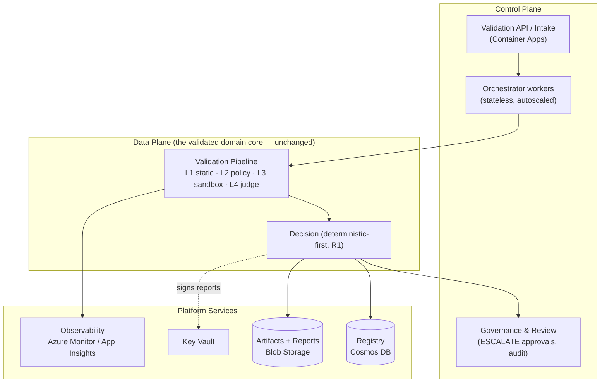
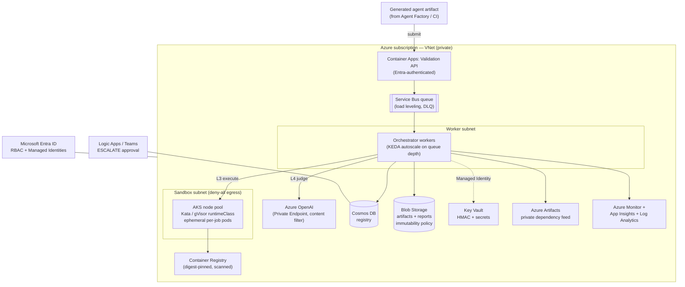
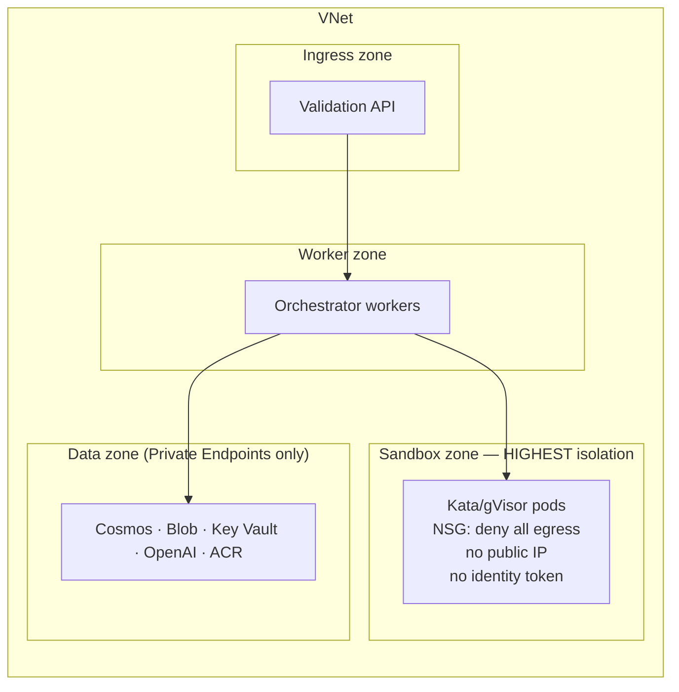
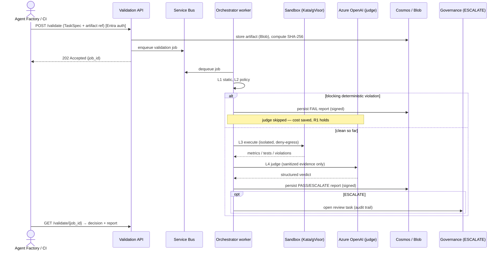
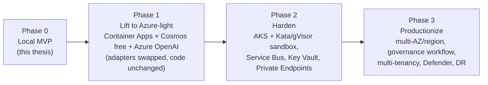

# Enterprise Architecture — Cloud-Native Validation Platform (Azure)

**Document type:** Target / Enterprise Architecture (vision)
**Status:** Draft for technical review
**Audience:** Technical lead / industry expert / enterprise architecture review
**Author:** Bobur Yusupov
**Version:** 0.1 (draft)
**Companion to:** `ARCHITECTURE.md` (local MVP), `README.md`

---

> **How to read this document.** `ARCHITECTURE.md` describes the **local PoC** that is actually built and evaluated in the thesis. *This* document describes the **enterprise target state** the PoC is designed to grow into. The crucial point — and the reason the MVP is credible at enterprise scale — is **ADR-001 (Ports & Adapters)**: the validated domain core (schemas, pipeline, decision logic) is **unchanged** between the two. Going enterprise means *swapping adapters and provisioning infrastructure*, not rewriting the validator.

---

## 1. Purpose & Relationship to the MVP

The MVP proves one mechanism — a layered validation pipeline — on a single host. An enterprise Agent Factory must run that same mechanism as a **multi-tenant, secure, observable, horizontally scalable service** that can validate generated micro-agents continuously and safely inside a corporate environment.

This document specifies that target state on **Microsoft Azure**, and the migration path from the PoC to it.

**Design invariant carried over from the MVP**

- Deterministic-first decision; the LLM judge never overrides a blocking security verdict (R1).
- Every run is reproducible and produces a hash-anchored, signed `ValidationReport`.
- Untrusted generated code only ever executes under strong isolation.

## 2. From MVP to Enterprise — the Adapter Realization

The MVP ships the left column; the enterprise platform realizes the right column **behind the same ports**. No domain-core code changes.

| Port / Concern | MVP adapter (local) | Enterprise adapter (Azure) |
|---|---|---|
| `Generator` | AutoGen harness (local) | AutoGen on Azure Container Apps; model via Azure OpenAI |
| `ModelClient` | OpenAI-compatible HTTP | **Azure OpenAI** w/ content filters + Private Endpoint, structured outputs |
| `Sandbox` | Local Docker, `--network=none` | **AKS node pool with Kata Containers / gVisor**, per-job ephemeral pod, deny-all egress (ACI as lighter tier) |
| `Registry` | SQLite + SHA-256 | **Azure Cosmos DB** (autoscale, multi-region) or PostgreSQL Flexible Server; HMAC key in **Key Vault** |
| `TelemetrySink` | JSONL files | **OpenTelemetry → Azure Monitor / Application Insights / Log Analytics** |
| Artifact storage | Local filesystem | **Azure Blob Storage** (immutable, versioned, lifecycle) |
| Job intake | Direct CLI call | **Azure Service Bus** queue (load leveling, retries, DLQ) |
| Secrets | `.env` | **Azure Key Vault** + Managed Identity (no secrets in code/CI) |
| Identity | OS user | **Microsoft Entra ID**, RBAC, Managed Identities |
| Dependency source | public PyPI (pinned) | **Azure Artifacts** private feed (curated allowlist) + signing |
| Sandbox base image | local image | **Azure Container Registry** (digest-pinned) + Defender image scanning |
| Human review (ESCALATE) | record flag | **Review queue + Logic Apps/Teams approval** workflow with audit trail |

## 3. Enterprise Quality Attributes (NFRs)

| Attribute | Target / Tactic |
|---|---|
| **Scalability** | Stateless workers behind a Service Bus queue; AKS/Container Apps autoscale on queue depth (KEDA). Validation throughput scales horizontally. |
| **Isolation (defense-in-depth)** | Sandbox runs in a dedicated subnet, in a Kata/gVisor runtime, ephemeral pod, deny-all egress, no mounted identity token, read-only rootfs, seccomp. |
| **Security** | Zero secrets in code; Managed Identity + Key Vault; Private Endpoints for all PaaS; Entra RBAC; Defender for Cloud posture. |
| **Auditability & integrity** | Immutable `ValidationReport` in Blob (WORM/immutability policy); registry row HMAC-signed with a Key Vault key; full decision lineage. |
| **Observability** | Distributed tracing (OTel) across orchestrator→layers→judge; metrics + dashboards + alerts in Azure Monitor. |
| **Reliability / HA** | Multi-AZ AKS; geo-redundant storage; multi-region Cosmos; queue retries + dead-letter; paired-region DR. |
| **Reproducibility** | Pinned model deployment + version; digest-pinned images; hashed dependency feed; provenance in every telemetry span. |
| **Multi-tenancy** | Tenant tag on every job/record; per-tenant policy bundles; RBAC-scoped data access; cost attribution by tenant. |
| **Cost governance** | Judge invoked only in full condition; autoscale-to-zero workers; serverless data tiers; per-run token + cost telemetry. |
| **Compliance** | MITRE ATLAS mapping on findings; data residency via region pinning; retention policies; approval audit. |

## 4. Logical View — Control Plane vs Data Plane

## 5. Azure Deployment Architecture

All PaaS services are reached over **Private Endpoints**; there is no public data-plane egress. Service-to-service auth uses **Managed Identities** (no stored secrets).

## 6. Network & Security Zones

**Sandbox zone hardening (defense-in-depth over the MVP's single Docker path):**

- Dedicated subnet, **NSG deny-all egress** + no public IP (untrusted code cannot phone home).
- **Kata Containers / gVisor `runtimeClass`** — kernel-level isolation beyond namespaces.
- Ephemeral pod per validation; `automountServiceAccountToken: false`; read-only root + tmpfs workspace; `seccomp`/AppArmor; non-root; CPU/mem/pids limits; host-enforced timeout.
- Kubernetes **NetworkPolicy** deny-all; admission control pins images by ACR digest.

## 7. Runtime Flow — Asynchronous, Queue-Based

Queue-based intake gives **load leveling, automatic retries, and a dead-letter queue** for poison jobs — none of which the synchronous MVP needs, but all of which an enterprise intake does.

## 8. Identity, Secrets & Supply Chain

- **Identity:** Microsoft Entra ID for callers (OAuth2/OIDC); **Managed Identities** for every service-to-service hop. No connection strings or API keys in code or CI.
- **Secrets & signing:** Azure Key Vault holds the HMAC signing key for registry records and any remaining secrets; accessed via Managed Identity with least-privilege RBAC.
- **Platform supply chain (the validator validating itself):**
  - Sandbox/base images built in CI, scanned (Defender for Containers), pushed to **ACR**, pinned by **digest**; AKS admission rejects unpinned/unscanned images.
  - Agent dependencies resolved only from a curated **Azure Artifacts** private feed (the enterprise realization of the MVP's allowlist + hash enforcement).

## 9. Data Architecture

| Store | Purpose | Enterprise features |
|---|---|---|
| **Cosmos DB** | Validation registry (decisions, hashes, lineage) | Autoscale RU/s, multi-region, TTL, partition by tenant; HMAC-signed records |
| **Blob Storage** | Artifacts + immutable `ValidationReport` JSON | Versioning, **immutability (WORM)** policy, lifecycle tiering, geo-redundancy |
| **Log Analytics** | Telemetry spans/metrics/logs | Retention policy, KQL dashboards, alerting |

The logical schemas (`TaskSpec`, `AgentSpec`, `ValidationReport`) are **identical** to the MVP — only the persistence adapter differs (ADR-002).

## 10. Observability

- **OpenTelemetry** instrumentation in the (unchanged) core, exported to **Application Insights / Azure Monitor**.
- Distributed trace per job: `intake → L1 → L2 → L3(sandbox) → L4(judge) → decision → persist`.
- Golden signals + domain metrics: Unsafe Acceptance Rate, Escalation Rate, p95/p99 latency per layer, cost per validation, sandbox-violation counts.
- Alerts: UAR spike, escalation backlog, sandbox failure rate, judge-disagreement drift, queue depth / DLQ growth.

## 11. Governance & Human-in-the-Loop

ESCALATE is a first-class enterprise workflow, not just a flag:

- A review task is created with the full (sanitized) evidence pack and deterministic findings shown first.
- Notification via **Logic Apps → Teams/email**; reviewer decision is recorded with identity + timestamp into an **immutable audit trail**.
- Reviewer outcomes feed back as labeled data to monitor judge calibration over time (closing the loop on the MVP's judge-agreement metric).

## 12. Scalability & Reliability

- **Scale:** KEDA autoscaling of orchestrator workers on Service Bus queue depth; AKS sandbox node pool scales independently; autoscale-to-zero when idle.
- **HA:** multi-AZ AKS and Container Apps; zone-redundant Service Bus; geo-redundant Blob; multi-region Cosmos.
- **Resilience:** retries + exponential backoff + DLQ; idempotent processing keyed by artifact hash (a re-submitted identical artifact returns the cached signed decision).
- **DR:** paired-region failover; IaC enables full environment rebuild.

## 13. CI/CD & Infrastructure as Code

- **IaC:** Bicep (Azure-native) or Terraform — entire platform is declarative and reproducible across `dev / staging / prod`.
- **CI/CD:** GitHub Actions (already wired for the MVP: ruff + pytest) extends to build/scan/push images, run policy/integration tests, and deploy via IaC with environment approvals.
- **Promotion:** the same container image (digest-pinned) flows dev → staging → prod; configuration (which adapters, which region) is environment-injected.

## 14. Cost Model (envelope, not a quote)

| Tier | Shape | Indicative cost |
|---|---|---|
| **Student / demo** | Cosmos free tier, single B-series VM or Container Apps consumption, Azure OpenAI on credit, scale-to-zero | ≈ within Azure for Students credit |
| **Pilot** | Small AKS (1–2 nodes) + Kata pool, autoscale workers, serverless Cosmos | low hundreds / month |
| **Production** | Multi-AZ AKS, multi-region Cosmos, geo-redundant storage, Defender | scales with validation volume |

Cost is dominated by (a) sandbox compute and (b) judge tokens — both already metered per run in the MVP telemetry, so capacity planning uses real PoC numbers.

## 15. Enterprise Architecture Decision Records

### ADR-E1 — Queue-based asynchronous intake
- **Decision:** validation jobs flow through Service Bus, not synchronous calls.
- **Rationale:** load leveling, retries, DLQ, decoupled autoscaling; sandbox execution latency is variable and must not block callers.
- **Consequences:** + elastic, resilient; + idempotency by artifact hash. − eventual (async) results; callers poll or subscribe.

### ADR-E2 — AKS + Kata/gVisor for the sandbox tier
- **Decision:** untrusted code runs under a hardened `runtimeClass` (Kata Containers or gVisor) on a dedicated, egress-denied node pool.
- **Alternatives:** plain Docker (MVP), ACI (lighter), bare VMs.
- **Rationale:** kernel-level isolation + network containment is the enterprise answer to the MVP's documented container-escape limitation (MVP ADR-003 / risk K7).
- **Consequences:** + strong defense-in-depth. − operational complexity (justified at enterprise scale; ACI offered as a lighter alternative).

### ADR-E3 — Managed Identity + Key Vault, zero secrets in code
- **Decision:** all auth via Entra Managed Identities; secrets and the HMAC signing key in Key Vault.
- **Consequences:** + no secret sprawl, auditable access. − requires Azure identity plumbing (IaC-managed).

### ADR-E4 — Cosmos DB as the registry, signed records
- **Decision:** Cosmos DB (autoscale, multi-region) as the registry adapter; records HMAC-signed.
- **Rationale:** global distribution, tenant partitioning, TTL, HA — while preserving the MVP's exact logical record (ADR-002). PostgreSQL Flexible Server is the relational alternative.
- **Consequences:** + scale + HA + integrity. − higher cost than SQLite (intended; this is the enterprise tier).

### ADR-E5 — Private-only data plane
- **Decision:** every PaaS dependency reached via Private Endpoint; sandbox subnet has deny-all egress.
- **Rationale:** prevents data exfiltration by untrusted code and reduces attack surface.
- **Consequences:** + strong containment. − VNet/DNS/private-link configuration overhead (IaC-managed).

## 16. Migration Path — Phased Rollout

Each phase is independently demonstrable and reversible. Phase 1 alone is achievable within the Azure for Students envelope and is the natural next step after the thesis defense.

## 17. Compliance & Threat Mapping

- Findings are categorized against **MITRE ATLAS** (adversarial ML/LLM tactics), giving reviewers a recognized taxonomy.
- Data residency enforced by region pinning; retention and immutability policies on reports; full approval audit for ESCALATE.
- Defender for Cloud provides continuous posture management for the platform itself.

---

### Appendix — What stays the same vs what changes

| Stays identical (validated in the MVP) | Becomes an enterprise adapter / service |
|---|---|
| `TaskSpec` / `AgentSpec` / `ValidationReport` schemas | persistence backend (SQLite → Cosmos/Blob) |
| Four-layer pipeline + `Layer` contract | sandbox runtime (Docker → Kata/gVisor on AKS) |
| Deterministic-first decision logic (R1) | model endpoint (OpenAI-compatible → Azure OpenAI) |
| Sanitized-evidence judge (ADR-005) | telemetry sink (JSONL → Azure Monitor/OTel) |
| Benchmark conditions as layer compositions | intake (CLI → Service Bus async API) |

> The thesis claim "this validator embeds into an enterprise Agent Factory" is therefore not aspirational — it is a direct consequence of the Ports & Adapters core proven in the MVP.
